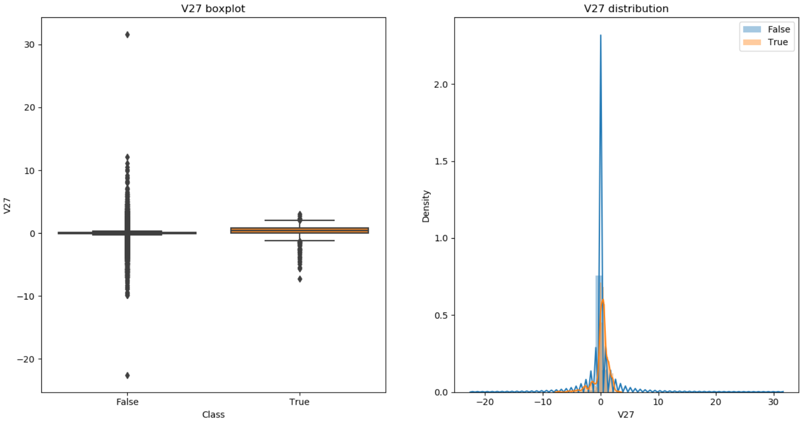

# Tutorial-Fraud-Detection

# Introduction
In this tutorial, we will learn about how to build a classifier for fraud detection. Fraud detection is important so that people don’t lose money.

I will be using the Credit Card Fraud Detection dataset from Kaggle. The data was collected and analyzed during a research collaboration between Worldline and the Machine Learning Group of ULB on big data mining and fraud detection.

The tutorial will cover the following tasks:
  1.	Bird’s eye view of the dataset
  2.	Exploratory data analysis (EDA)
  3.	Modelling
  4.	Evaluation of different ML algorithms
  5.	Next steps
  
# A Brief Look At The Dataset:
The dataset is stored in a csv format. It contains 31 columns. There is 1 target variable and 30 potential predictors (potential because we may remove features that have no correlation with the target variable). The creator of the dataset could not provide the original features due to confidentiality issues. Thus, the creator has provided us with PCA-transformed features. Hence all features are numerical.

Now it’s time for EDA!

# Exploring The Data:
There are 31 columns in the dataset. The names of the columns are

 
The PCA-transformed features are *V1-V28*. Features like *Time*, *Amount* and *Class* have not been transformed.

Let’s look at the data types for each of the columns

None of the columns have NULL values which means that we probably don’t have any missing values. Also except *Class*, all other features are floats. It is interesting to see that Time is not a DateTime or TimeStamp object. Thus, we should inspect it further, like other features, to assess its predictive utility. Furthermore, *Class* should be a Boolean data type and thus we will cast it as one.
Before we calculate descriptive statistics, we must remove duplicated transactions so that they do not distort the statistics. There are 1081 duplicate transactions that need to be removed.

After removing the duplicate transactions, we can calculate descriptive statistics. The PCA-transformed features provide little information about the original features. Thus, we will only calculate descriptive statistics for *Time*, *Amount* and *Class*.

*Time* has a minimum of 0 and maximum of 172792. Given the percentiles, we can infer that *Time* is non-decreasing. This means that it is always growing upwards. However, this trend may not be useful in detecting fraud unless we perform some feature engineering. 
 
*Amount* has an average of around 88 and most transactions fall in the 0-100 range. There might be a few outliers that we may want to deal with later.

*Class* is a Boolean variable and it only has 2 unique values. The most common value is False with 283253 occurrences. Thus, fraudulent transactions account for only 0.167% of the data! There is a huge class imbalance.

Clearly, the number of non-fraudulent transactions severely outweigh the number of fraudulent ones. We must solve the class imbalance issue before modelling because we would create biased models if we trained the models on imbalanced data.

Now that we are done examining some basic information about the features, let’s dive deeper into how important each feature is in detecting fraud.

From the plots, we can clearly notice can there are some features that have little to no impact on detecting fraud. Thus, we can drop these features. I will drop *Time*, *V1*, *V5*, *V6*, *V8*, *V13*, *V15*, *V18*, *V19*, *V20* – *V28* and *Amount*. However, you can experiment and see which columns give the best result.

At this stage, we have a set of features that have some correlation with fraud. However, we must make sure that these features are not highly correlated with each other as this can cause problems during modelling (eg: highly correlated features have similar coefficients in logistic regression). I hypothesize that the features will display little multicollinearity because our feature set only contains the PCA transformed features. PCA projects data along orthogonal vectors and hence the features should be independent from each other. To test our hypothesis, we will construct a correlation matrix to check for multicollinearity.

Clearly, all the features are mostly independent of each other and thus we do not drop any more features. The features that are most strongly correlated with *Class* are *V17* and *V14*.

**NOTE**: We will not remove outliers because there is a massive class imbalance and removing outliers will further reduce the dataset.

# Modelling:
Fraud detection is a classification problem. There are several classifiers that we could train. However, it is important that we use models that can be debugged and explained since it helps to understand why the model acted in a certain way. Thus, we will use logistic regression and random forest in this tutorial.

To prepare the data for the modelling phase, we will first shuffle the data. This may improve cross-validation accuracy later on. Then we split the data into training and testing set using a 80:20 ratio. The next step would be to standardize the data but all our features are PCA-transformed and hence they are already normalized.

We are almost ready to start modelling. We must take care of the class imbalance problem. One way to fix the problem is to oversample the minority class so that we have an equal number of instances of both classes in the dataset. One thing to note is that we will only perform oversampling on the training set since we do not want to contaminate the original testing set with synthetic data points.
The modelling phase involves training the models on the training data and then creating predictions on the testing data using the model. Both our models, logistic regression and random forest, have a number of hyperparameters can be tuned for optimal performance. How do we know which hyperparameters are the best? We can perform a grid search. We will do this use cross-validation to avoid overfitting. In this tutorial, we will use 5-fold cross-validation. 

**NOTE**: Increasing the number of estimators in a random forest will almost always improve the performance. Thus, the number of estimators should be chosen using the ‘elbow method’ with the default parameters. Once the number of estimator has been obtained, then you can run a grid search for tuning other hyperparameters.

We need to optimize over a metric to run machine learning algorithms. In fraud detection, it is important to every possible fraudulent transaction even though this means having more false positives. Thus, fraud detection algorithms need to have high recall. However, precision is also important, and you can optimize over F1 to find the best trade-off between recall and precision. In this tutorial, we will optimize over recall.

# Evaluation:
We will evaluate the best model found during the grid search using a variety of metrics like precision, recall, confusion matrix, ROC curve and Precision-Recall curve. Precision-Recall curves are particularly useful when dealing with imbalanced datasets. 

We can see that logistic regression has a higher recall score than random forest and thus it seems that it did a better job at optimizing over the chosen metric. However, random forest outperformed logistic regression on all other metrics except ROC AUC. Hence, random forest is a more balanced classifier because it achieves a better precision-recall trade-off. Moreover, the precision-recall plot is more informative that the ROC plot for imbalanced datasets. Since PR AUC is greater than ROC AUC, this signals that random forest is a better classifier than logistic regression.

It is also interesting to look at feature importance to see which features are most indicative of fraud. In terms of magnitude, *V14* was the most influential feature for both models. *V12* and *V4* were also in the top 5 features for both models. In general, it is nice to know feature importance because we can explain why the model made a decision based on powerful/influential a feature is. In terms of random forest, we can even visualize the decision making of a single decision tree!

The above is a snippet of the entire tree.

# Next Steps:
The data science workflow is an iterative process. You will almost always get better results if you refine the pipeline continuously. To this end, some of the next steps I would recommend are:

  1.	Perform more feature engineering. I completely some ignored features that might help in predicting fraud. For instance, looking at       the difference of *V5* and *V15* might be an interesting feature. 
  2.	I only trained two models. Usually, multiple models are run in industry and form an ensemble. This ensemble makes better                 predictions than any single model. You can experiment with different models and various ensemble of models.
  3.	I ran a very conservative hyperparameter search because I wanted to demonstrate how to do it. The predictive power of the               classifier will improve quite drastically by tuning more hyperparameters with a larger grid search. However, a larger grid search       means that you are training exponentially more models which will take a lot of time and memory.
  4.	Try a different number of cross-validation folds. Traditionally, the number of folds is 5 or 10.
  5.	To tackle the class imbalance issue, I used the SMOTE algorithm. However, there are more algorithms and methods to available to         solve this issue. For instance, try different oversample and undersampling techniques and see which ones give the best result.

